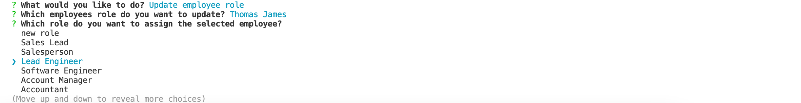

# track-employees

## Description 
This application is used to add new departments, roles and employees to the database.
As well as table showing employee data including employee ids, first names, last names, job titles, departments, salaries, and managers that the employees report to.

## Installation
To make sure this application works you'll need to install a few dependancies,  (console.table, dotenv, inquirer and "mysql2. You will also have to change the .env.EXAMPLE file to a simple .evn file and add you credentials the necessary fields.

## Usage
To start, go to your CLI and login to your mysql once in mysql run your schema and seeds files, this will create your tables and database. Once done log out of sql and run you're node server.js You will then be presented with a list that looks like this. 

Let's say you would like to view the departments press enter once that option is selected, you will know it is selected because it is the colour blue not black. 

If you would like to view all the roles with in the company. Press down or up to navigate your way there and press enter. 

If you would like to view all the employees with in the company. select the view all employees option. 

If you would like to add a new department navigate your way to the Add a department section and press enter, you will then be prompted to add a department name once done press enter and to confirm that the new department has been added it will show up in green writing. 

If you woud like to add a new role simply navigate your way to the Add a role section and press enter, you will then be prompted to add a new role name and what the salary will be for this one plus the department it belongs to.

If you would like to add a new employee, navigate your way to the add an employee section and press enter. You will then be prompted to enter a first and last name plus the department they will be in and the managers name. 

Let's say you have added an employees details incorrectly or you would like to update the details of an existing employee simply navigate your way to the update employee role section and press enter. You will then be asked to select the employee you want to update and what role they have. The press enter to complete. 

Once you are done using navigate your way to the quit section and press enter.

If you would like a more indepth preview on how to use please see video on how to use <a href="https://drive.google.com/file/d/1t2RwdJFThqkaSfwVEOXfH89HlRDpLZyL/view?usp=sharing">How To Use Video</a>

## Questions 
If you have any questions please contact me on my Github <a href="https://github.com/skipsterling">skipsterling</a>